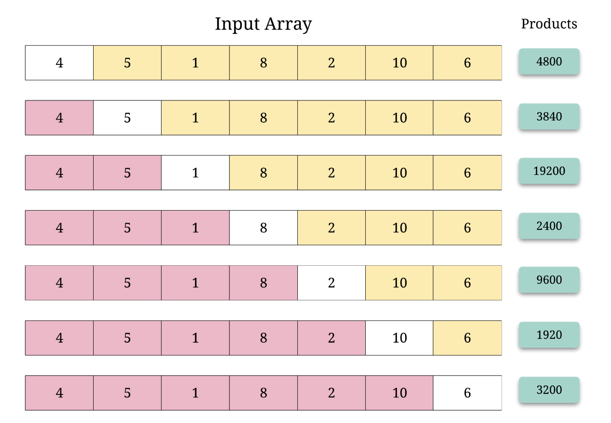
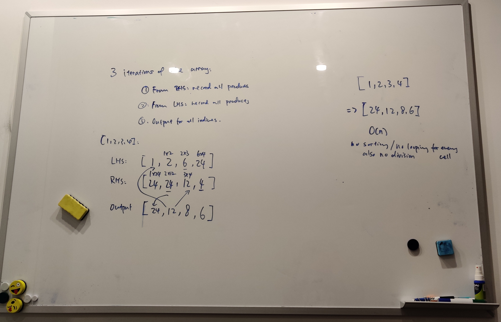

# Summary
Difficulty: Easy 
[Link to problem](https://leetcode.com/problems/product-of-array-except-self/) 
## sol1: 14%

算法很好理解，但是书写的时候要严谨。RHS的index很容易写错（除非是一开始就把RHS的array的位置
控制好，同位置填写）
# Topics
- Array