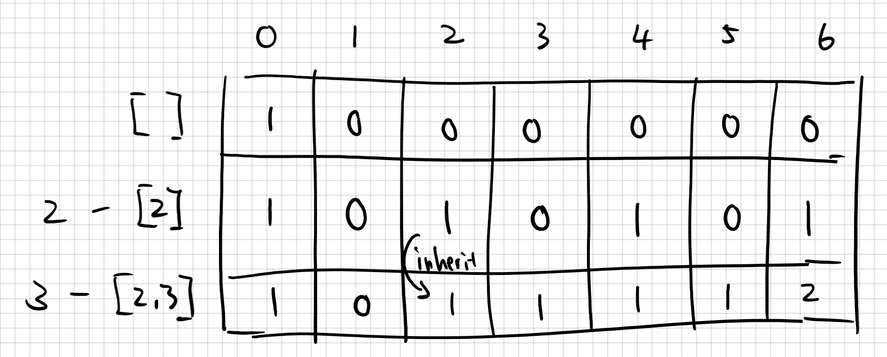

# Summary
Difficulty: Medium 
[Link to problem](https://leetcode.com/problems/coin-change-2/) 
## sol1: 544ms(19%)
用了Table Filling，coin种类作为Row，避免duplicate combination 

# Topics
- Dynamic Programming 
- Table Filling