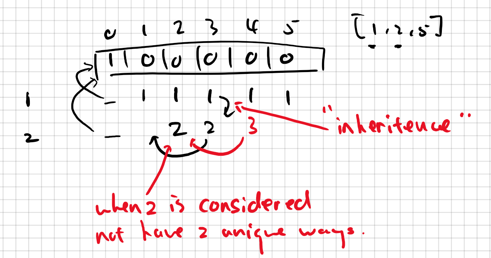

# Summary
Difficulty: Medium 
[Link to problem](https://leetcode.com/problems/coin-change-2/) 
## sol1: 544ms(19%)
用了Table Filling，coin种类作为Row，避免duplicate combination 

## sol2: 136ms(89%)
一个更加简洁的写法。说实话我自己写不出来。值得一提的是，coins的顺序打乱也没关系 

# Topics
- Dynamic Programming 
- Table Filling
- Unique Combination