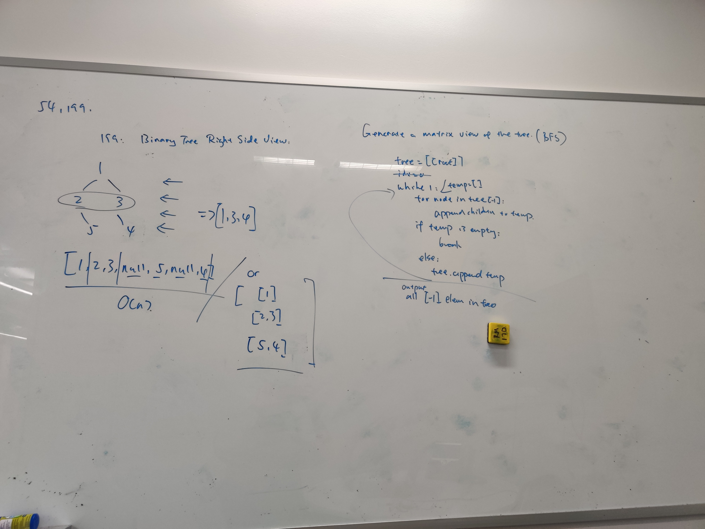

# Summary
Difficulty: Medium 
[Link to problem](https://leetcode.com/problems/binary-tree-right-side-view/) 
## sol1: 61%

一开始想复杂了，写法很简单。注意bass by assignment/value也适用于for loop。同时append会append reference。unless a.append(b[:])
# Topics
- Tree
- DFS/BFS
