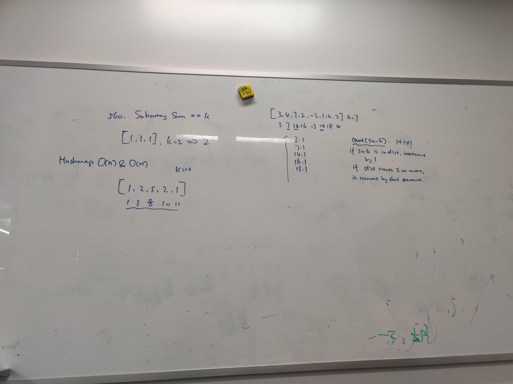

# Summary
Difficulty: Medium 
[Link to problem](https://leetcode.com/problems/subarray-sum-equals-k/) 
## sol1: 89%

真正意义上的好题，这个答案已经是最优解。如果想要理解这个算法，需要想清楚什么情况下会出现一个valid substring，并且可以在O(1)的时间内判断是否正确。就是靠检测前面的array中是否出现过sum - k，出现过几次。
# Topics
- Array